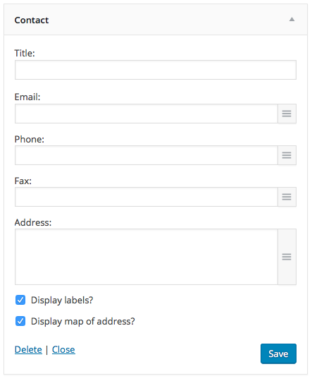
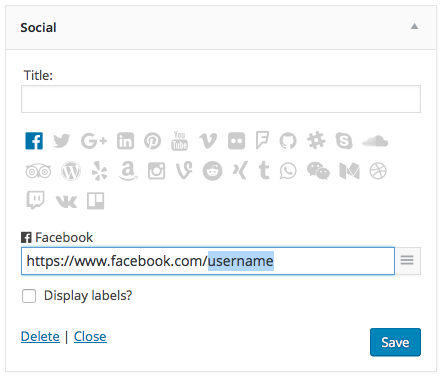
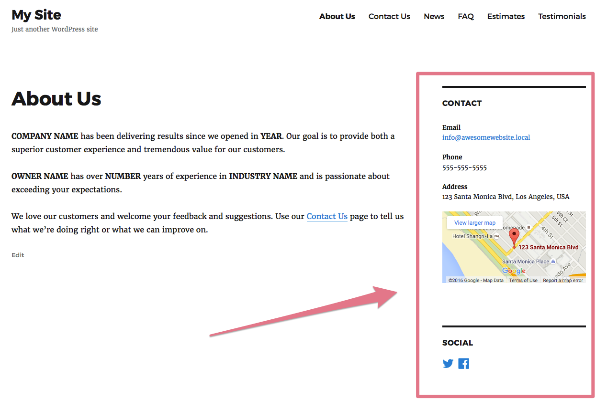

<!-- DO NOT EDIT THIS FILE; it is auto-generated from readme.txt -->
# Contact Widgets


Beautifully display social media and contact information on your website with these simple widgets.

**Contributors:** [godaddy](https://profiles.wordpress.org/godaddy), [jonathanbardo](https://profiles.wordpress.org/jonathanbardo), [fjarrett](https://profiles.wordpress.org/fjarrett)  
**Tags:** [widget](https://wordpress.org/plugins/tags/widget), [contact](https://wordpress.org/plugins/tags/contact), [social](https://wordpress.org/plugins/tags/social), [sharing](https://wordpress.org/plugins/tags/sharing), [share button](https://wordpress.org/plugins/tags/share button), [share buttons](https://wordpress.org/plugins/tags/share buttons), [share links](https://wordpress.org/plugins/tags/share links), [social icons](https://wordpress.org/plugins/tags/social icons), [social media](https://wordpress.org/plugins/tags/social media), [facebook](https://wordpress.org/plugins/tags/facebook), [twitter](https://wordpress.org/plugins/tags/twitter), [google plus](https://wordpress.org/plugins/tags/google plus), [instagram](https://wordpress.org/plugins/tags/instagram)  
**Requires at least:** 4.4.2  
**Tested up to:** 4.7  
**Stable tag:** 1.3.4  
**License:** [GPL-2.0](https://www.gnu.org/licenses/gpl-2.0.html)  

[](https://travis-ci.org/godaddy/wp-contact-widgets) [](http://gruntjs.com) 

## Description ##

**Note: This plugin requires PHP 5.4 or higher to be activated.**

This plugin adds two new widgets to your WordPress website:

*  Contact Information: Displays your contact information including email address, phone number, fax and physical address (including a map).
*  Social Media Profiles: Displays your social media profiles in an attractive, intuitive way.

Both widgets are compatible with the WordPress Customizer and will automatically refresh when changes are made.

**Languages Supported:**

* English
* Dansk
* Deutsch
* Ελληνικά
* Español
* Español de México
* Suomi
* Français
* हिन्दी
* Bahasa Indonesia
* Italiano
* 日本語
* 한국어
* मराठी
* Bahasa Melayu
* Norsk bokmål
* Nederlands
* Polski
* Português do Brasil
* Português
* Русский
* Svenska
* ไทย
* Tagalog
* Türkçe
* Українська
* Tiếng Việt
* 简体中文
* 香港中文版
* 繁體中文

**Improvement? Bugs?**

Please fill out an issue [here](https://github.com/godaddy/wp-contact-widgets/issues).

## Screenshots ##

### Contact widget



### Social widget



### Twenty Sixteen theme showing both widgets



## Frequently Asked Questions ##

### How do I add additional fields to the contact widget?

Adding additional fields to the contact widget is as simple as adding a WordPress filter.

Here is an example:
```php
add_filter( 'wpcw_widget_contact_custom_fields', function( $fields, $instance ) {

  $fields['cellphone'] = [
    'order'       => 2,
    'label'       => __( 'Cellphone:', 'YOURTEXTDOMAIN' ),
    'type'        => 'text',
    'description' => __( 'A cellphone number that website vistors can call if they have questions.', 'YOURTEXTDOMAIN' ),
  ];

  return $fields;

}, 10, 2 );
```

### How do I add additional fields to the social widget?

The social widget requires a different set of options but follows the same principle as above.

Here is an example:
```php
add_filter( 'wpcw_widget_social_custom_fields', function( $fields, $instance ) {

  $fields['scribd'] = [
    'icon'      => 'scribd', //See font-awesome icon slug
    'label'     => __( 'Scribd', 'YOURTEXTDOMAIN' ),
    'default'   => 'https://www.scribd.com/username',
    'select'    => 'username',
    'sanitizer' => 'esc_url_raw',
    'escaper'   => 'esc_url',
    'social'    => true,
    'target'    => '_blank',
  ];

  return $fields;

}, 10, 2 );
```

## Changelog ##

### 1.3.3 - October 14, 2016 ###
* Minor bug fixes
* Remove edit button when previewing in the customizer

### 1.3.2 - August 16, 2016 ###
* WordPress 4.6 compatibility
* Fix bug with edit button not working
* Plugin icon update
* Update translation
* New: Add RSS to social networks.

Props [@jonathanbardo](https://github.com/jonathanbardo), [@fjarrett](https://github.com/fjarrett)

### 1.3.1 - June 3, 2016 ###
* New: Language support for `mr`.
* New: Add 500px to social networks.

Props [@jonathanbardo](https://github.com/jonathanbardo), [@fjarrett](https://github.com/fjarrett), [@salvoventura](https://github.com/salvoventura)

### 1.3.0 - May 19, 2016 ###
* New: Add front-end "Edit" link to quickly edit widgets in the Customizer.
* Fix: Use WP-CLI nightlies in tests.

Props [@jonathanbardo](https://github.com/jonathanbardo), [@fjarrett](https://github.com/fjarrett)

### 1.2.0 - April 12, 2016 ###
* New: WordPress 4.5 compatibility.
* Tweak: Improve widget names.

Props [@jonathanbardo](https://github.com/jonathanbardo), [@fjarrett](https://github.com/fjarrett)

### 1.1.0 - March 15, 2016 ###
* New: Support localization on Google Maps.

Props [@jonathanbardo](https://github.com/jonathanbardo), [@fjarrett](https://github.com/fjarrett)

### 1.0.4 - March 9, 2016 ###
* Tweak: Language updates.

Props [@jonathanbardo](https://github.com/jonathanbardo)

### 1.0.2 - February 24, 2016 ###
* New: Language support for 27 locales.

Props [@jonathanbardo](https://github.com/jonathanbardo)

### 1.0.1 - February 24, 2016 ###
* New: Added possibility to add custom fields to contact and social widget.

Props [@jonathanbardo](https://github.com/jonathanbardo)

### 1.0.0 - February 23, 2016 ###
* Initial release.

Props [@jonathanbardo](https://github.com/jonathanbardo), [@fjarrett](https://github.com/fjarrett)


